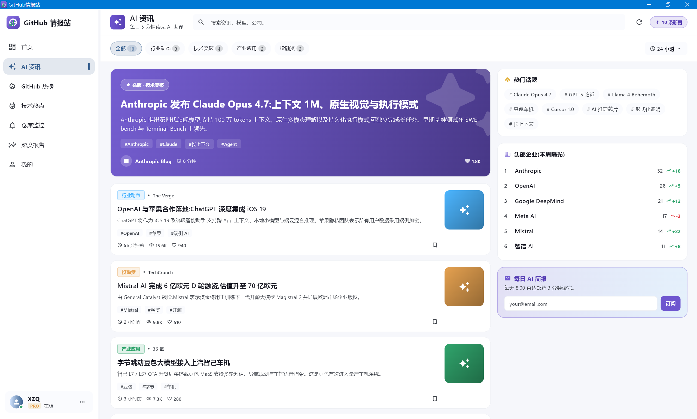
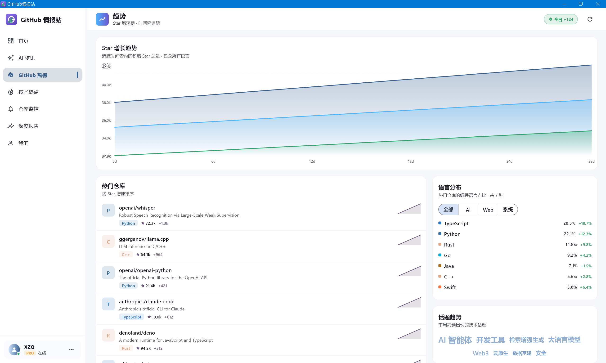
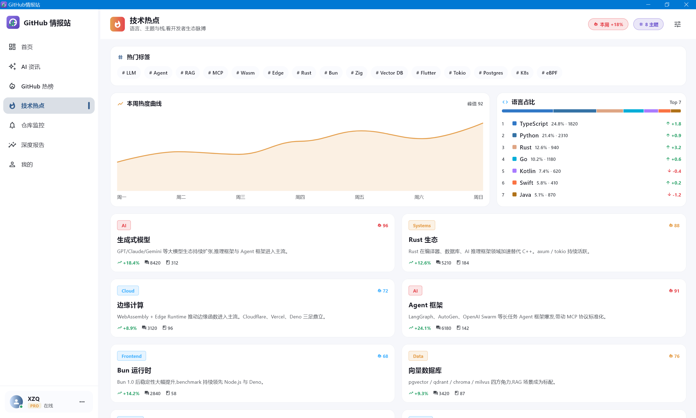
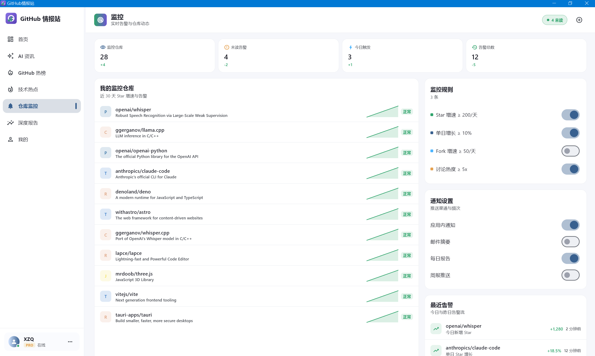
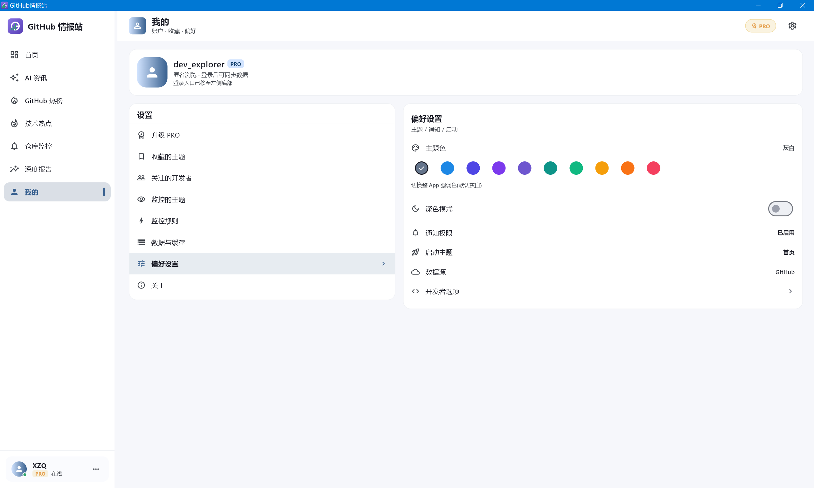

# AI资讯

面向开发者的 AI + GitHub 本地优先情报工作台。项目使用 Flutter 构建，优先支持 Windows 桌面端；紧凑窗口和移动端使用独立的 5 Tab 导航。

## 界面预览

以下截图采集于 2026-06-27，保留为早期桌面版视觉记录；当前品牌、导航和部分页面布局已经演进，能力判断以“当前能力”和实际代码为准。

| AI 动态 | GitHub 热榜 | AI 雷达 |
|---|---|---|
|  |  |  |

| 仓库监控 | 设置 |
|---|---|
|  |  |

## 当前能力

- 桌面端 8 个主入口：总览、AI 动态、GitHub 热榜、AI 雷达、发现、仓库监控、深度报告、设置。
- 紧凑窗口和移动端 5 个主入口：总览、AI、发现、监控、我的；总览由 GitHub 热榜的 Star 增长榜、热门仓库、话题趋势，以及 AI 雷达的标签、Agent 榜、信号热度、语言占比、主题列表共 8 个内容区块组成，两个完整页面继续作为二级页面保留。
- AI 动态接入远端资讯源；GitHub 热榜、AI 雷达、发现、监控、详情和报告接入 GitHub Search / Repository / Contributors / Events / Rate Limit API。
- 所有远端响应统一标记为在线数据、新鲜缓存、过期缓存或种子数据；趋势和指标另行标记真实观测、估算或种子口径。
- 仓库监控在应用前台加载或刷新时记录每日 Star/Fork 观测，计算增长、停更、活跃下降和贡献者集中度规则，并把命中事件持久化到本机告警中心。
- 告警支持已读、归档和恢复；收藏、监控仓库、关注开发者均保存真实实体快照，规则、主题和通知设置也在本机闭环。
- 仓库详情和深度报告展示 GitHub Events API 的真实活动；失败时只回退对应缓存，不生成看似真实的样例事件。
- 深度报告基于仓库、贡献者和活动数据生成本地聚合，并支持按当前语言导出 Markdown。
- GitHub 单资源请求支持 ETag 条件缓存；远端失败时优先使用过期缓存，最后才使用种子数据。
- AI 资讯支持设置页源管理、连续失败健康状态、FTS5 全文检索、来源/时间/已读过滤、多源事件聚类、本地兴趣排序，以及逐条 LLM 摘要、翻译、重要性评分和实体缓存。
- Windows 关闭窗口后可隐藏到系统托盘；进程常驻时每 15 分钟刷新 AI 资讯，新条目进入应用内提醒中心，并尽力发送本机系统通知。
- 可选的 `server/` 自托管服务提供定时采集、版本化跨设备配置同步、工作区成员与共享批注、可靠推送 outbox/webhook 衔接和 GH Archive 小时数据聚合。客户端不连接服务端时仍保持完整本地可用性。

## 缓存与数据边界

| 数据 | 新鲜缓存时效 |
|---|---:|
| AI 动态、GitHub 热榜、AI 雷达 | 5 分钟 |
| 仓库监控 | 10 分钟 |
| 仓库详情、深度报告 | 30 分钟 |
| 发现 | 6 小时 |
| Agent Skills 排行 | 24 小时 |

- SQLite 保存远端快照、每日观测和告警事件；SharedPreferences 保存非敏感的本机偏好与内容状态。
- GitHub Token 使用 `flutter_secure_storage`，在 Windows 上由 DPAPI 保护；旧版明文 Token 会在首次读取时迁移并清理。
- GitHub OAuth 设备登录只在构建时提供 `GITHUB_OAUTH_CLIENT_ID` 后出现；未配置构建只展示 Personal Access Token 路径。
- 配置导出仅包含受支持的非敏感偏好；导入先完整校验，写入失败会回滚，Token 永不进入配置文件。
- 本地数据库或偏好初始化失败时显示恢复页，可重试或打开数据目录，不会自动删除用户数据。
- Flutter 客户端仍以本机 SQLite/SharedPreferences 为事实源；自托管服务端是显式配置的可选增强，不参与客户端启动依赖。服务端 API Key 与 GitHub/LLM Key 一样使用系统安全存储，不进入配置导出。
- 托盘刷新属于桌面进程常驻能力，不等于操作系统在应用完全退出后的后台任务；移动系统推送需要在服务端 outbox 后接入真实 FCM/APNs/WNS 凭据和网关。
- 跨天趋势依赖本机积累的真实观测；历史不足时会明确显示估算口径。

## 技术栈

| 维度 | 选型 |
|---|---|
| 框架 | Flutter / Dart |
| 状态管理 | flutter_riverpod |
| 路由 | go_router |
| 网络 | dio |
| 本地存储 | shared_preferences、sqflite_common_ffi、flutter_secure_storage |
| 桌面集成 | tray_manager、window_manager、local_notifier |
| 可选服务端 | FastAPI、SQLite、httpx、Uvicorn、Docker Compose |
| 图表 | fl_chart |
| 图片 | cached_network_image |
| 测试 | flutter_test、mocktail |

## 运行与验证

```bash
flutter pub get
flutter run -d windows
```

提交或发布前运行：

```bash
dart format .
flutter analyze
flutter test
flutter build windows --release
powershell -NoProfile -ExecutionPolicy Bypass -File tools/windows_tray_smoke.ps1
```

服务端验证在 `server/` 下运行 `uv run ruff check .`、`uv run pytest` 和 `uv run python tools/live_smoke.py`，部署说明见 [server/README.md](server/README.md)。

Codex 环境中的命令需加 `rtk` 前缀。更完整的环境和发布说明见 [RUN.md](RUN.md)。

## 文档

- [产品信息架构与数据方案](docs/plans/product_ia_data_plan.md)
- [文档索引](docs/README.md)
- [运行指南](RUN.md)
- [变更记录](CHANGELOG.md)
- [项目规则](AGENTS.md)
- [自托管服务端](server/README.md)

## 当前状态

当前开发基线为 `1.4.0+4` 加 `Unreleased` 改动。阶段一的多源聚合、资讯库、资讯↔GitHub 和 LLM 日报已经扩展到完整的阶段二客户端能力：独立 Settings、源管理、LLM 条目增强、事件聚类、FTS5、兴趣反馈、托盘与提醒均已落地。新的 `server/` 边界已经以可选、自托管方式实现定时采集、同步、协作、推送衔接和 GH Archive 分析；外部移动推送仍需部署者提供真实平台凭据，仓库不伪造已上线状态。
