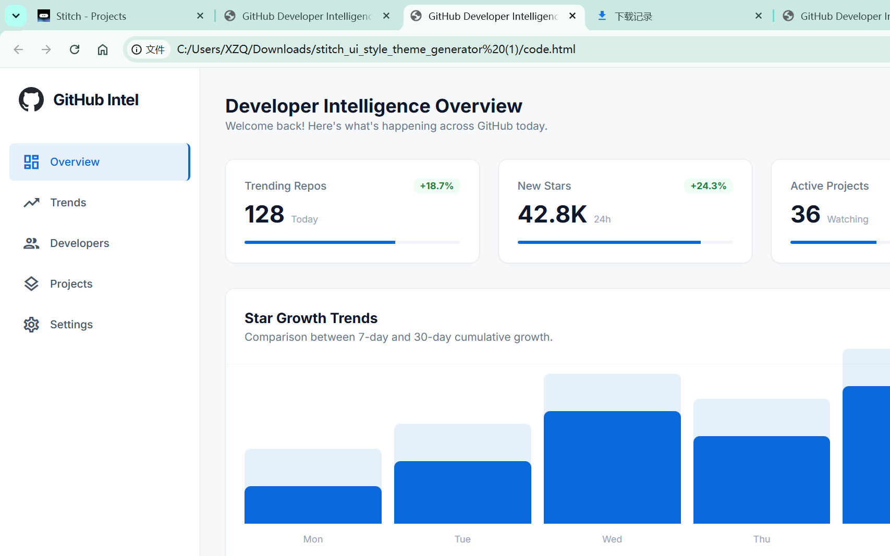

# GitHub情报站 (GitHub Developer Intelligence)

> 一款基于 Flutter 的 GitHub 仓库趋势分析与监控告警桌面应用,
> 用沉浸式自绘标题栏、响应式三档布局与 Material 3 主题,为你盯住每一个值得关注的仓库。

[](#支持平台)
[](https://flutter.dev)
[](https://dart.dev)

---

## ✨ 功能特性

- **趋势榜 / 增长榜 / 健康榜 / 收藏趋势榜** 四个 Tab 联动,首页同一份数据多视角查看
- **Star 增长趋势图** 7 天 / 14 天 / 30 天可切换,本周与上周对比一目了然
- **语言分布** 按全部 / AI / Web / 系统分类筛选,交互式柱状图
- **响应式三档布局**:Compact(< 600dp)底部导航、Medium(600–1024dp)紧凑侧栏、Expanded(≥ 1024dp)宽侧栏
- **沉浸式无边框窗口**:Windows 端自定义标题栏(min/max/close),品牌色与浅色 / 深色主题自适应
- **品牌 Logo**:自绘渐变 + G 字轮廓 + 上升柱图,无外部资产依赖

---

## 🖼️ 预览

| 桌面端(浅色) | 桌面端(深色) |
| --- | --- |
|  |  |

> 截图位于 `docs/`,运行 `tools/generate_app_icon.py` 可重新生成应用图标。

---

## 📦 支持平台

| 平台 | 优先级 | 备注 |
|---|---|---|
| Windows | 主开发平台 | 沉浸式无边框 + 自绘标题栏 |
| macOS | 目标 | 桌面端验证 |
| Linux | 目标 | 桌面端验证 |
| Android | 优先 | 真机调试 |
| iOS | 优先 | 需 macOS 构建 |
| iPadOS / Android 平板 | 优先 | 自适应布局 |

---

## 🛠️ 技术栈

| 维度 | 选型 |
|---|---|
| 框架 | Flutter ≥ 3.22(Dart ≥ 3.4) |
| 状态管理 | `flutter_riverpod` |
| 路由 | `go_router`(`StatefulShellRoute.indexedStack`) |
| HTTP | `dio` + 拦截器(超时 / 重试 / 限流) |
| 本地数据库 | `drift` |
| 键值存储 | `shared_preferences` |
| 图表 | `fl_chart` |
| 数据模型 | `freezed` + `json_serializable` |
| 图片缓存 | `cached_network_image` |
| 测试 | `flutter_test` + `mocktail` |

---

## 🧭 5 个 Tab

| Tab | 路径 | 职责 |
|---|---|---|
| `home` | `/home` | 概览仪表盘:今日趋势、监控告警摘要、关注仓库动态 |
| `trending` | `/trending` | GitHub 仓库趋势列表(语言 / 时间窗 / Star 增速筛选) |
| `monitor` | `/monitor` | 监控规则管理、告警列表、阈值配置 |
| `project` | `/project` | 已收藏 / 已监控仓库集合,支持分组与备注 |
| `profile` | `/profile` | 个人偏好、登录入口(预留)、主题与缓存设置 |

> 顶层 Tab 用 `StatefulShellRoute.indexedStack` 维护各自独立的导航栈。

---

## 💾 缓存策略

| 数据 | TTL | 存储 |
|---|---|---|
| Trending 列表 | 5 min | drift |
| Repo 详情 | 30 min | drift |
| Star 历史 | 增量快照 | drift,主键 `(owner, name, date)` |
| 用户偏好 | 永久 | shared_preferences |

---

## 🗂️ 目录结构

```
github_news/
├── pubspec.yaml
├── analysis_options.yaml
├── lib/
│   ├── main.dart                # 入口,仅做 bootstrap
│   ├── app.dart                 # MaterialApp.router + 主题注入
│   ├── core/                    # 跨特性通用能力
│   │   ├── network/             # dio + 拦截器
│   │   ├── storage/             # drift + shared_preferences
│   │   ├── theme/               # 设计 token(颜色 / 字体 / 间距 / 圆角)
│   │   ├── router/              # go_router 配置
│   │   ├── di/                  # 全局 Provider
│   │   ├── errors/              # AppException 体系
│   │   ├── platform/            # 平台差异扩展(WindowService 等)
│   │   └── utils/               # 时间 / 格式化 / 断点
│   ├── features/                # 每个特性三层:data / domain / presentation
│   │   ├── home/
│   │   ├── trending/
│   │   ├── monitor/
│   │   ├── project/
│   │   └── profile/
│   └── shared/
│       ├── widgets/             # ResponsiveScaffold / AppSidebar / WindowTitleBar / StarTrendChart / ErrorView / Skeleton
│       └── extensions/
├── test/
├── integration_test/
├── tools/                       # 一次性脚本(应用图标生成等)
└── docs/                        # 设计稿 / 截图 / 参考资料
```

> 通用编码规范见 [CLAUDE.md](./CLAUDE.md)。

---

## 🚀 快速开始

### 环境要求

- Flutter SDK ≥ 3.22
- Dart SDK ≥ 3.4
- 已安装目标平台工具链(Windows SDK / Xcode / Android SDK 等)

### 拉依赖与生成代码

```bash
flutter pub get
dart run build_runner build --delete-conflicting-outputs
```

### 提交前必跑

```bash
dart format .
flutter analyze
flutter test
```

### 运行与打包

```bash
# 开发
flutter run -d windows
flutter run -d macos
flutter run -d linux
flutter run -d android
flutter run -d ios

# 打包
flutter build apk --release
flutter build windows --release
flutter build macos --release
```

---

## 🪟 沉浸式窗口实现要点

桌面端通过下列方式实现无边框窗口 + 自定义标题栏:

1. `windows/runner/win32_window.cpp` — 将窗口样式从 `WS_OVERLAPPEDWINDOW` 改为 `WS_POPUP | WS_THICKFRAME`,去除系统标题栏
2. `WM_NCHITTEST` — 把窗口顶部 32px 识别为 `HTCAPTION`,使 Flutter 自绘的标题栏仍可拖动窗口
3. `flutter_window.cpp` — 注册 `github_news/window` MethodChannel,处理 `minimize` / `maximize` / `close` / `isMaximized`
4. `lib/core/platform/window_service.dart` + `lib/shared/widgets/window_title_bar.dart` — 平台桥接 + 自定义标题栏

非 Windows 平台使用同一套 `WindowService`,调用静默降级为 no-op。

---

## 🤝 贡献

欢迎提交 Issue 与 PR。代码风格遵循 [CLAUDE.md](./CLAUDE.md),提交前请运行 `dart format . && flutter analyze && flutter test`。

Commit 信息使用 Conventional Commits:`<type>(<scope>): <subject>`,例如
`feat(trending): 新增按语言筛选功能`。

---

## 📄 许可证

本项目以 MIT 许可证开源。
